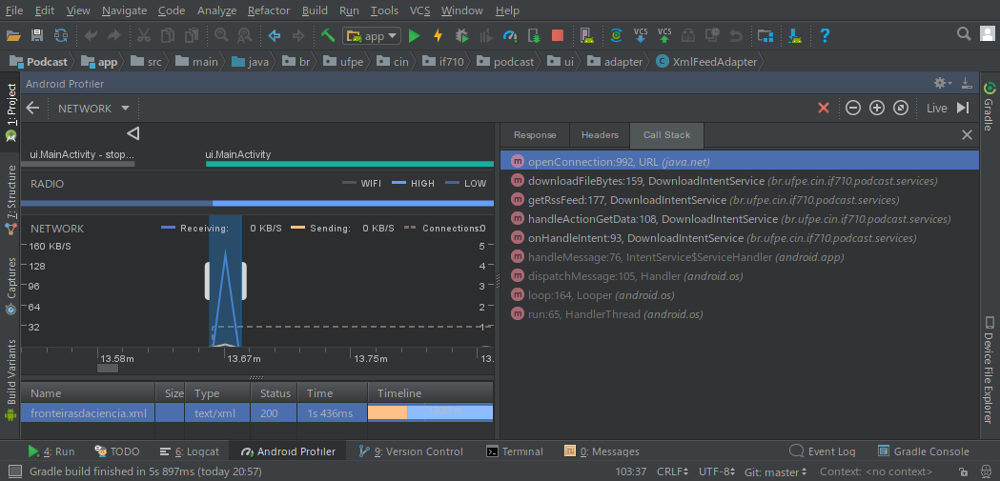
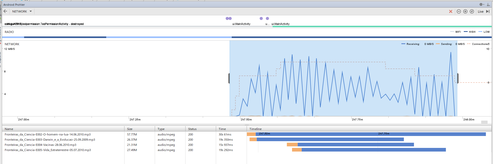

# Consumo de Rede

## Android Profiler

Ao abrir a aplicação, é atualizada a lista de podcasts. A chamada do DownloadIntentService pode ser observada na Call Stack a seguir:

### Download de 4 podcasts simultâneos

O download de podcasts acontece normalmente.

