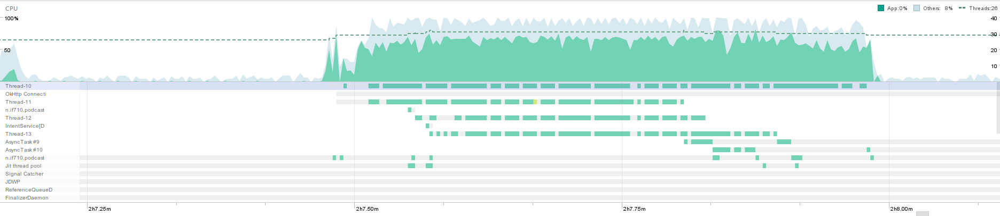

# CPU & Performance

## Android Profiler

### MediaPlayer não parece usar muita cpu

### Download de 4 podcasts simultâneos

Os 4 downloads ativos usaram quase todo o poder de processamento, mas 30% disto veio de outros processos.

