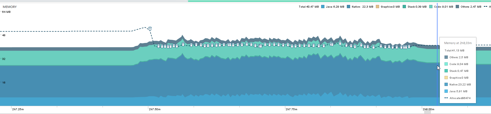
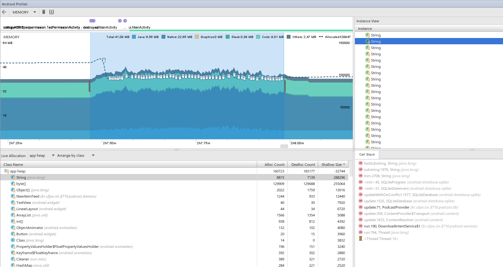

# Memória

## Android Profiler

### Download de 4 podcasts simultâneos

Podemos ver as chamadas ao garbage collector durante os downloads a seguir

Nos detalhes da heap é visível que Strings e byte[] usaram a maior parte da memória (shallow, que é o espaço ocupado pelo próprio objeto)

