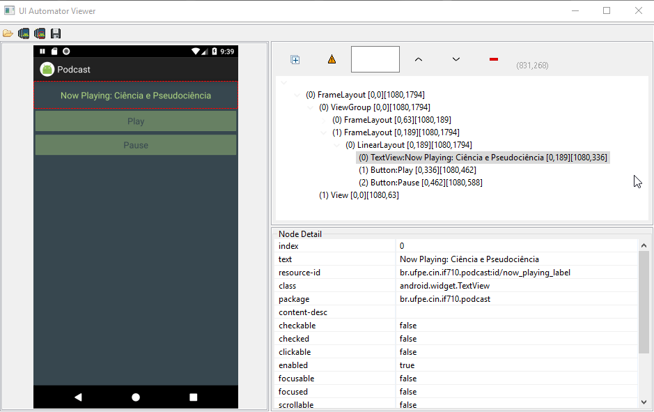

# Testes

## Testes de Unidade com JUnit4

Devido a natureza do aplicativo ser somente um app de download de Feeds RSS de Podcast e reproduzi-lo, implementamos testes de unidade relacionados ao parsing do feed do Podcast em questão.

Além disso,
não testamos outras classes implementadas, por elas dependerem muito da plataforma Android para a execução, fugindo um pouco do conceito de teste unitário isolado das classes. Poderiamos ter usado ferramentas de Mock(como o Mockito) para a simulação do comportamento da plataforma Android, mas decidimos por não faze-lo.

## Testes de Instrumentação com UIAutomator

Nos testes de instrumentação, optamos por utilizar o framework UIAutomator, por permitir mais operações do que a ferramente Espresso. Para isso, utilizamos a ferramente UIAutomatorViewer para a visualização da estrutura XML de cada activity testada.

A nossa Suite de teste de instrumentação buscou fazer o caminho básico do nosso app. Escolher um episódio de Podcast para fazer o download. Dar Play em um episódio já na memório do celular, e utilizar dos comandos Play e Pause para o controle do Podcast, verificando se as notificações condizem com oque realmente está acontecendo.

Para facilitar a implementação dos testes, adicionamos ,aos botões de realizar download play, **content-descriptions**, pois eles possuiam o mesmo **resource_id**.

 A adição de resources ids e content descriptions aos elementos da UI são muito importantes para os testes instrumentados, pois permite dados constantes dentro do app, indenpendente da Localização(região e linguagem do celular).

Embora o resource id seja muito importante, tivemos problemas ao utiliza-lo, pois o UIAutomator em emuladores, muitas vezes não consegue recuperar os resources ids dos elementos.

Então recorremos a utilizar somente o posicionamento dos elementos na árvore xml, e outros atributos como texto e content description.